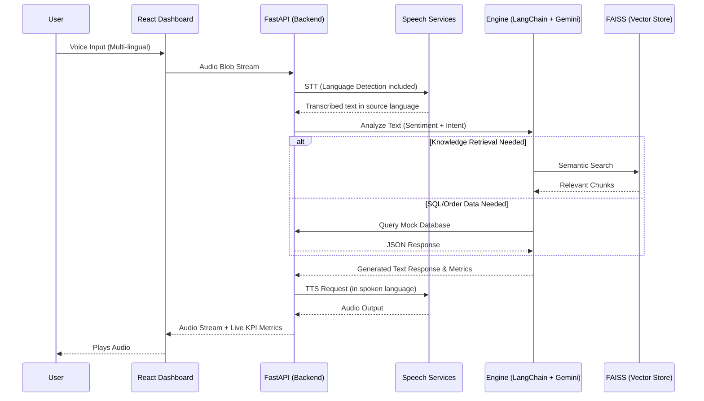

l# ShopNow AI Voice Agent Architecture

## Overview
This document outlines the architecture for the ShopNow AI Voice Agent, a highly resilient, multi-turn conversational agent capable of serving Tier-1 customer support needs in English, Hindi, and regional languages. 

## Hybrid RAG Approach & Data Flow

The system employs a **Hybrid RAG** (Retrieval-Augmented Generation) design. The hybrid element refers to combining structured database queries (mock Orders/Returns database) with unstructured vector retrieval (FAISS documentation/policy index) via LangChain's intelligent routing.

### 1. Intent Detection & Routing
When a transcribed user utterance is received, the primary LLM agent (Gemini) determines the intent among:
*   `ORDER_STATUS` -> Routes to structured mock DB lookup.
*   `RETURN_INITIATION` -> Looks up return policy in FAISS and validates against the order DB.
*   `PAYMENT_ISSUE` -> Handled via standard QA or immediate escalation.
*   `DELIVERY_COMPLAINT` -> Registers the complaint structurally, assesses sentiment.
*   `PRODUCT_QUERY` -> Routes strictly to the FAISS RAG index.

### 2. Conversational Memory
The agent maintains an ephemeral `ConversationBufferMemory` context over the session lifecycle. The STT (Speech-to-Text) module retains the user's language preference and enables seamless code-switching.

### 3. Sentiment & Escalation
At each utterance, the LLM provides a hidden sentiment score. If the sentiment crosses a negative threshold, an "Escalation Brief" is constructed containing:
* Customer Name
* Issue Summary
* Sentiment Timeline
* Suggested Human Tone
This brief is subsequently pushed via WebSockets or Server-Sent Events to the React.js operation dashboard.

## System Sequence Flow

